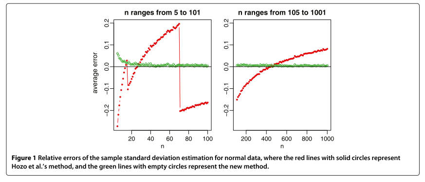

```{r setup, include = FALSE}
knitr::opts_chunk$set(
  collapse = TRUE,
  comment = "#>"
)
```

# Tasks

# Wan replication overview

## Specifically what simulations did Wan do?

### Relative error plots



- $x$-axis presents something like $n = 2, .., 1000$. 
Not sure of what specifics. I'm sure I saw something about increments of 2 and 
starting at 8.
- $y$-axis presents mean relative error.

## Over what distributions?

|Distribution|
|---|
|$\mathrm N(\mu = 50, \sigma^2 = 17^2)$|
|$\mathrm{lognormal}(\mu = 4, \sigma = 0.3)$|
|$\mathrm{beta}(\alpha = 9, \beta = 4)$|
|$\exp(\lambda = 10)$|
|$\mathrm{Weibull}(k = 2, \lambda = 35)$|

# Simulate data
```{r Trials}
# Set trials.
trials <- 10 # Set low for testing. 
```


```{r Parameters}
# Create simulation tibble.
wan_sim <- cross(list(
  dist = dist,
  n = seq(8, 1000, by = 2),
  trial = c(1:trials)
)) %>% {
    tibble(
      rdist = map_chr(., c("dist", "rdist")),
      rpars = map(., c("dist", "rpars")),
      n = map_dbl(., "n"),
      trial = map_int(., "trial")
    )
  }

# Take a look.
wan_sim %>% head() %>% knitr::kable()  
```

```{r Tally}
wan_sim %>% 
  count(rdist, as.character(rpars), n) %>% 
  filter(nn != trials) %>% 
  nrow() == 0L

```

## Generate summary and samples

```{r Sample summary}
wan_sim <- wan_sim %>% 
  mutate(ss = pmap(list(n, rdist, rpars), dontpanic::sample_summary),
         sample = map(ss, "sample"),
         summary = map(ss, "summary"))

# Take a look.
wan_sim %>% head() %>% knitr::kable()

```

# Estimators

