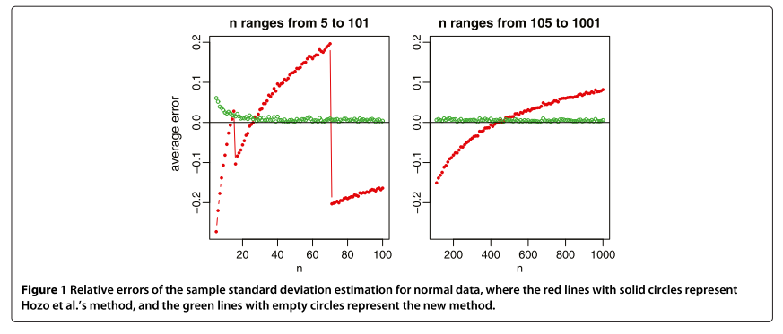

```{r setup, include = FALSE}
knitr::opts_chunk$set(
  collapse = TRUE,
  comment = "#>"
)
```

# Tasks

# Wan replication overview

## Specifically what simulations did Wan do?

### Relative error plots



- $x$-axis presents something like $n = 2, .., 1000$. 
Not sure of what specifics. I'm sure I saw something about increments of 2 and 
starting at 8.
- $y$-axis presents mean relative error.

## Over what distributions?

|Distribution|
|---|
|$\mathrm N(\mu = 50, \sigma^2 = 17^2)$|
|$\mathrm{lognormal}(\mu = 4, \sigma = 0.3)$|
|$\mathrm{beta}(\alpha = 9, \beta = 4)$|
|$\exp(\lambda = 10)$|
|$\mathrm{Weibull}(k = 2, \lambda = 35)$|


